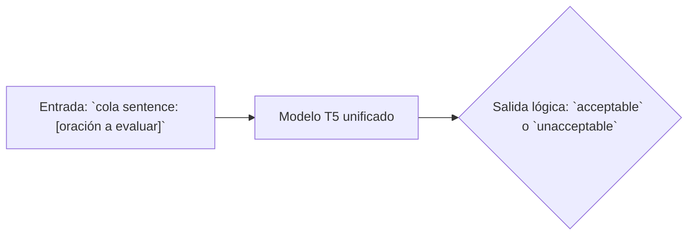
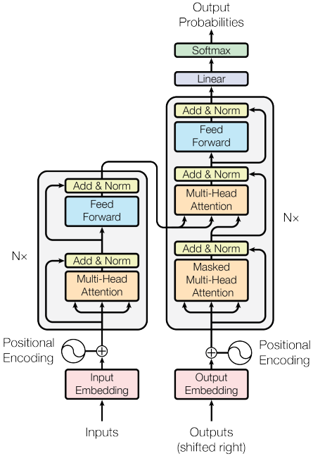
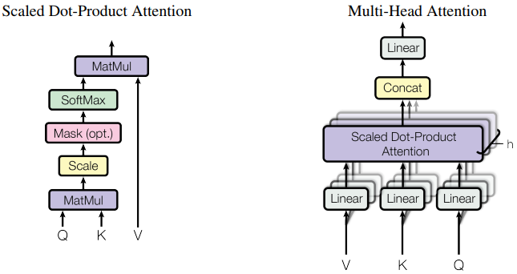
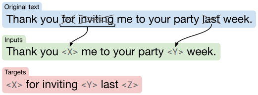
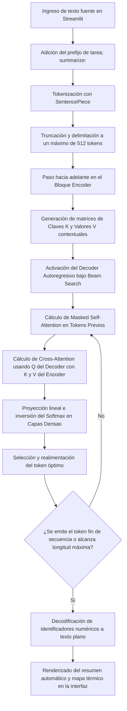
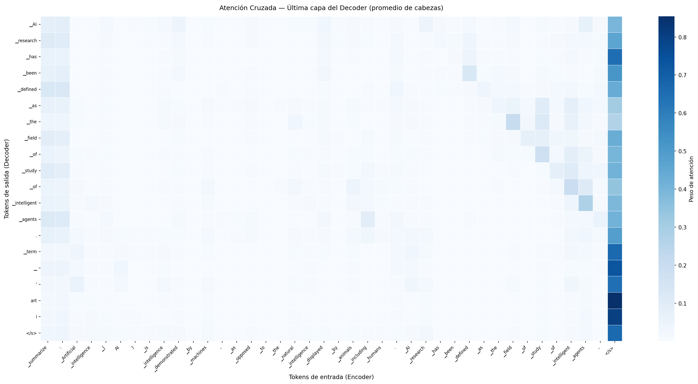

# T5 - Resumen Automático de Texto con Transformer Encoder-Decoder

**Procesamiento de Datos Secuenciales con Deep Learning**  
Universidad Autónoma de Occidente · 2025

| Integrante                 | Código   |
|----------------------------|----------|
| Alexander Calambas Ramirez | 22602907 |
| Angelo Parra Cortez        | 22506988 |
| Oscar Portela Ospina       | 22507314 |
| Sebastian Torres Cabrera   | 22507322 |

---

## 1. Resumen (Abstract)

Este proyecto implementa inferencia sobre el modelo **T5 (Text-to-Text Transfer Transformer)** de Google Research aplicado a la tarea de resumen automático de texto en inglés. T5 es una arquitectura Transformer encoder-decoder que unifica todas las tareas de procesamiento de lenguaje natural bajo un único framework: dado un texto de entrada con un prefijo de tarea, el modelo genera el texto de salida correspondiente. Se utilizan los pesos preentrenados disponibles en HuggingFace (`t5-small`, `t5-base` y variantes efficient) sin necesidad de entrenar desde cero. La interfaz interactiva desarrollada con Streamlit permite ingresar cualquier texto, visualizar el resumen generado, consultar métricas de compresión y explorar los pesos de atención cruzada entre encoder y decoder mediante un mapa de calor. Los resultados demuestran que un solo modelo preentrenado puede resumir textos de distintos dominios con ratios de compresión entre 3x y 8x manteniendo coherencia semántica.

---

## 2. Introducción

### 2.1 Artículo base

**Raffel, C., et al. (2020). "Exploring the Limits of Transfer Learning with a Unified Text-to-Text Transformer."** *Journal of Machine Learning Research*, 21(140), 1–67.

- Ficha del artículo en HuggingFace Papers: [https://huggingface.co/papers/1910.10683](https://huggingface.co/papers/1910.10683)
- Repositorio de código original (Google Research): [https://github.com/google-research/text-to-text-transfer-transformer](https://github.com/google-research/text-to-text-transfer-transformer)
- Pesos preentrenados utilizados: [google/t5-efficient-small](https://huggingface.co/google/t5-efficient-small) y variantes de la arquitectura original en [T5 community](https://huggingface.co/google-t5)

### 2.2 Contexto y problemática

Con anterioridad al desarrollo y consolidación del modelo Text-to-Text Transfer Transformer (T5), el estado del arte en el campo del procesamiento del lenguaje natural (NLP) estaba bajo un paradigma fragmentado. La optimización de tareas requería el diseño, entrenamiento y despliegue de arquitecturas altamente especializadas y segregadas según la naturaleza de la salida esperada. De este modo, los sistemas destinados a la traducción automática diferían en topología y funciones de pérdida de aquellos orientados al resumen de texto, la clasificación de sentimientos o la respuesta automatizada a preguntas. Esta metodología tradicional presentaba tres limitaciones:

1. **Fragmentación de arquitecturas:** Cada tarea lingüística demandaba un pipeline de ingeniería independiente, lo que implicaba una gestión dispar de hiperparámetros, esquemas de tokenización particulares y configuraciones de red específicas para cada caso de uso.
2. **Ineficiencia en la transferencia de conocimiento:** El aprendizaje de representaciones contextuales abstractas obtenido por un modelo en un dominio específico no se transfería de forma nativa hacia tareas, limitando el aprovechamiento del aprendizaje por transferencia y obligando a realizar costosos entrenamientos desde cero.
3. **Restricciones de escalabilidad:** La incorporación de una nueva capacidad lingüística o nuevas tareas no podía aprovechar la infraestructura preexistente, demandando el aprovisionamiento, diseño y validación de un ecosistema computacional completamente nuevo.

### 2.3 Solución propuesta por T5

Para resolver las ineficiencias de la fragmentación de tareas, la arquitectura T5 reformula metodológicamente el procesamiento de datos secuenciales al unificar todos los problemas de NLP bajo un framework operativo conceptualizado como un mapeo de texto a texto. Bajo esta abstracción, el modelo no altera su topología de red ni sus capas de salida en función de la tarea; en su lugar, recibe como secuencia de entrada una cadena de caracteres que incluye de forma explícita un prefijo léxico que instruye al sistema sobre la operación condicional esperada, produciendo otra cadena de caracteres como secuencia de salida.

Esta estandarización permite que un único conjunto jerárquico de pesos preentrenados resuelva de forma simultánea problemas computacionales dispares. A continuación, se describen los flujos operacionales que caracterizan esta unificación de tareas:

**Flujo 1: Resumen abstracto de texto**


**Flujo 2: Traducción lingüística condicional**


**Flujo 3: Evaluación de aceptabilidad lingüística (CoLA)**


### 2.4 Objetivo del proyecto

El propósito central de esta investigación aplicada consiste en implementar un entorno funcional de inferencia utilizando la arquitectura Transformer encoder-decoder de T5, optimizada específicamente para la tarea de resumen automático de texto en inglés. Se busca estructurar un pipeline capaz de procesar secuencias lingüísticas de alta densidad conceptual, integrando variantes arquitectónicas de escala reducida y de alta eficiencia como t5-efficient-small.

A nivel técnico y metodológico, el proyecto persigue el desarrollo de una interfaz interactiva basada en Streamlit que actúe como un laboratorio visual; a través de este módulo, se auditarán en tiempo real los coeficientes matemáticos de la matriz de atención cruzada mediante mapas térmicos bidimensionales para demostrar la viabilidad y robustez del paradigma text-to-text, validando la reducción de la latencia y la tasa de compresión bajo entornos de hardware limitados.

---

## 3. Marco teórico

### 3.1 Arquitectura Transformer Encoder-Decoder original y la variante T5

La arquitectura Transformer convencional, introducida por Vaswani et al. [2], supuso una ruptura con los modelos basados en redes neuronales recurrentes y convolucionales al fundamentar el procesamiento de secuencias exclusivamente en mecanismos de atención. 

El bloque del encoder transforma una secuencia de representaciones continuas de tokens de entrada $X = (x_1, ..., x_n)$ en una secuencia de vectores ocultos o contextualizados $Z = (z_1, ..., z_n)$. Cada capa del encoder consta de dos subcapas principales: un mecanismo de atención multi-cabeza autorregresivo bidireccional y una red neuronal Position-Wise Feed-Forward. 

Por otra parte, el bloque del decoder genera una secuencia de salida $Y = (y_1, ..., y_m)$ de forma autorregresiva, es decir, token a token, utilizando las representaciones contextuales $Z$ provistas por el encoder y los tokens previamente generados. El decoder clásico añade una tercera subcapa intermedia dedicada a la atención cruzada (cross-attention), la cual conecta funcionalmente ambos bloques.

  
<small>Figura 1: La arquitectura del modelo Transformer. Adaptado de [2]</small>

El modelo Text-to-Text Transfer Transformer (T5), formulado por Raffel et al. [1], adopta esta estructura secuencial clásica, pero introduce modificaciones estructurales fundamentales para optimizar la eficiencia y la estabilidad del gradiente durante el aprendizaje por transferencia a gran escala. A diferencia de las tendencias contemporáneas que simplificaron la arquitectura hacia configuraciones de solo encoder como BERT o solo decoder como GPT, T5 sostiene que mantener la arquitectura encoder-decoder resulta óptimo para resolver tareas generales de secuencias complejas de texto a texto.

### 3.2 Mecanismo Multi-Head Attention

El núcleo operacional de la arquitectura Transformer es la **Scaled Dot-Product Attention**. Este mecanismo computa la relevancia mutua entre los elementos de las secuencias mapeando matrices de consultas ($Q$), claves ($K$) y valores ($V$). Las proyecciones lineales se obtienen a partir de una matriz de entrada de activaciones $X$ multiplicada por matrices de pesos entrenables, definidas formalmente de la siguiente manera.

La matriz de consultas se expresa como:
$$Q = XW_Q$$

La matriz de claves se expresa como:
$$K = XW_K$$

La matriz de valores se expresa como:
$$V = XW_V$$

Donde las dimensiones de los pesos corresponden a $W_Q \in \mathbb{R}^{d_{model} \times d_k}$, $W_K \in \mathbb{R}^{d_{model} \times d_k}$ y $W_V \in \mathbb{R}^{d_{model} \times d_v}$. La función matemática que rige la asignación de pesos de atención y la agregación del contexto se define mediante la ecuación de producto escalar escalado:

$$Attention(Q, K, V) = softmax\left(\frac{QK^T}{\sqrt{d_k}}\right)V$$

El factor de escala $\frac{1}{\sqrt{d_k}}$ mitiga el crecimiento desproporcionado de las magnitudes de los productos escalares cuando la dimensionalidad $d_k$ es elevada, evitando que la función softmax sature en regiones de gradiente infinitesimalmente pequeño.

  
<small>Figura 2: (izquierda) Scaled Dot-Product Attention. (derecha) Multi-Head Attention. Adaptado de [2]</small>

Para enriquecer la capacidad de representación, se implementa la Multi-Head Attention. En lugar de realizar una única operación de atención sobre las dimensiones globales, el modelo proyecta linealmente $h$ veces las consultas, claves y valores de forma independiente en subespacios dimensionales reducidos. Cada proyección se procesa en paralelo mediante la función de atención escalada, y las salidas resultantes se concatenan para ser proyectadas nuevamente a la dimensión original del modelo:

$$MultiHead(Q, K, V) = Concat(head_1, ..., head_h)W_O$$

Donde cada cabeza individual se calcula como:
$$head_i = Attention(QW_{Q,i}, KW_{K,i}, VW_{V,i})$$

Los parámetros de proyección por cada cabeza corresponden a las matrices de pesos $W_{Q,i} \in \mathbb{R}^{d_{model} \times d_k}$, $W_{K,i} \in \mathbb{R}^{d_{model} \times d_k}$, $W_{V,i} \in \mathbb{R}^{d_{model} \times d_v}$ y la proyección de salida $W_O \in \mathbb{R}^{h d_v \times d_{model}}$. Esta descomposición permite que el sistema atienda simultáneamente a información proveniente de diferentes subespacios de representación y distintas coordenadas posicionales.

### 3.3 Tipos de atención en la arquitectura T5

La variante T5 distribuye el mecanismo de Multi-Head Attention en tres modalidades funcionales diferenciadas a lo largo de su estructura secuencial, controlando de forma estricta el flujo de información y las dependencias temporales.

| Tipo de atención                      | Dónde                                 | $Q$                                                                               | $K$                                                                                                         | $V$                                                                                                         | Propósito                                                                                                                                                                                                                                                                            |
|:--------------------------------------|:--------------------------------------|:----------------------------------------------------------------------------------|:------------------------------------------------------------------------------------------------------------|:------------------------------------------------------------------------------------------------------------|:-------------------------------------------------------------------------------------------------------------------------------------------------------------------------------------------------------------------------------------------------------------------------------------|
| **Self-Attention del Encoder**        | Capas internas del bloque Encoder     | Derivada de las activaciones de la capa previa del encoder                        | Derivada de las activaciones de la capa previa del encoder                                                  | Derivada de las activaciones de la capa previa del encoder                                                  | Permite una codificación completamente bidireccional, donde cada token del texto de entrada atiende a todos los demás tokens de la secuencia sin restricciones de causalidad.                                                                                                        |
| **Masked Self-Attention del Decoder** | Capas inferiores del bloque Decoder   | Derivada de las activaciones de la capa previa del decoder                        | Derivada de las activaciones de la capa previa del decoder                                                  | Derivada de las activaciones de la capa previa del decoder                                                  | Limita el campo receptivo mediante una máscara causal que inicializa con valor de infinito negativo los elementos superiores de la matriz de atención, previniendo que el decoder acceda a información de tokens futuros durante el entrenamiento autoregresivo.                     |
| **Cross-Attention**                   | Subcapa intermedia del bloque Decoder | Proviene directamente de la normalización de la subcapa previa dentro del decoder | Proviene directamente de las representaciones contextuales finales generadas por la última capa del encoder | Proviene directamente de las representaciones contextuales finales generadas por la última capa del encoder | Actúa como el puente de transferencia de información. El decoder emite consultas para buscar correspondencias semánticas dentro de las claves y valores del encoder, extrayendo el conocimiento sintáctico de la secuencia original necesario para guiar la generación de la salida. |

### 3.4 Innovaciones arquitectónicas de T5

El desarrollo de T5 introdujo variaciones respecto al diseño de Vaswani de 2017 [2], redefiniendo los estándares de estabilidad en el entrenamiento y la flexibilidad en la transferencia de conocimiento de los modelos masivos de lenguaje.

#### 3.4.1 Framework Text-to-Text unificado 

La innovación principal propuesta por Raffel et al. [1] consiste en la unificación conceptual de todas las tareas del procesamiento de lenguaje natural bajo un único formato secuencial de entrada y salida de texto. Al anteponer un prefijo descriptivo explícito (por ejemplo, el prefijo de tarea para este proyecto consiste en la cadena de texto de entrada traducida a tokens como un comando explícito `summarize: `), el modelo reutiliza exactamente la misma arquitectura, la función de pérdida por entropía cruzada y la estrategia de decodificación para tareas estructuralmente diferentes como la traducción, la clasificación, la regresión y el resumen automático.

#### 3.4.2 Sesgo de posición relativa o Relative Position Bias 

T5 prescinde por completo de los embeddings de posición absoluta de naturaleza sinusoidal o aprendida aplicados directamente sobre la entrada del modelo. En su lugar, implementa un sesgo posicional relativo donde los logits de atención se modifican en función de la distancia matemática existente entre el token de consulta y el token de clave. La función de atención modificada adopta la siguiente formulación matemática:

$$Attention(Q, K, V) = softmax\left(\frac{QK^T}{\sqrt{d_k}} + B\right)V$$

Donde $B$ representa una matriz de sesgo posicional entrenable. Para optimizar la eficiencia computational, T5 emplea una asignación por compartimentos logarítmicos (logarithmic bucketing), la cual asigna un parámetro de sesgo único para distancias relativas cortas y agrupa distancias mayores en un número fijo de categorías. Esta innovación otorga una capacidad de generalización superior al procesar secuencias significativamente más extensas que aquellas presentes durante el régimen de preentrenamiento.

#### 3.4.3 Preentrenamiento mediante corrupción de fragmentos o Span Corruption en C4 

En contraposición al enmascaramiento de tokens unitarios implementado en arquitecturas tradicionales como BERT, T5 fundamenta su preentrenamiento auto-supervisado en la tarea de corrupción de fragmentos continuos de texto, reemplazándolos con sentinel tokens especiales. Este proceso se ejecutó sobre el conjunto de datos Colossal Clean Crawled Corpus o C4, un corpus de aproximadamente 750 GB de texto web filtrado mediante reglas heurísticas estrictas para remover contenido repetitivo o sintácticamente defectuoso. Esta aproximación entrena de forma nativa la naturaleza generativa del bloque decoder para la reconstrucción secuencial de secuencias lingüísticas coherentes.

  
<small>Figura 3: Esquema del objetivo utilizado en el modelo base - Span Corruption. Adaptado de [1]</small>

#### 3.4.4 Arquitectura de linealidad sin sesgo o Bias-Free Dense Layers 

Con el propósito de optimizar el consumo de memoria en hardware de aceleración masiva y suprimir parámetros redundantes, T5 elimina por completo los vectores de sesgo aditivo en todas las transformaciones lineales asociadas a las proyecciones densas de consultas, claves y valores, así como en las capas internas de la Feed-Forward Network. Las operaciones correspondientes conservan estrictamente una naturaleza multiplicativa de matrices de pesos ponderados.

#### 3.4.5 Estabilización por RMSNorm en configuración Pre-Norm 

T5 modifica la topología de las conexiones residuales del Transformer clásico. En lugar de aplicar la normalización de capa de manera posterior a la suma residual, sitúa el bloque de normalización de forma previa a la ejecución de cada subcapa, manteniendo un canal libre para la propagación del gradiente en arquitecturas de gran profundidad. Adicionalmente, sustituye la técnica LayerNorm convencional por RMSNorm (Root Mean Square Normalization) formulada por Zhang y Sennrich [7]. Esta variante prescinde de la operación de centrado basada en la media y limita el cómputo exclusivamente al escalado por la raíz de la media de los cuadrados, lo que reduce el costo computational por iteración en el orden del 7-10% sin detrimento de la convergencia de la red.

$$A_{i,j} = \frac{q_i k_j^T}{\sqrt{d_k}} + B(i-j)$$

### 3.5 Configuración de parámetros de T5 base

El modelo T5-Base contiene aproximadamente 220 millones de parámetros con una configuración de parámetros total exacta de 222.855.168 pesos. Estos se basan en sus dimensiones estructurales principales: $d_{model} = 768$, $d_{ff} = 3072$, $d_{kv} = 64$, empleando 12 cabezas de atención y 12 capas tanto para el encoder como para el decoder.

La distribución matemática de estos parámetros se divide de la siguiente manera:

- **Capa de Embeddings y proyección de vocabulario:** Comparten una matriz única para **32.128** tokens por la dimensión de **768**, concentrando exactamente **24.674.304** parámetros.
- **Bloque del Encoder de 12 capas:** Suma un total de **84.934.656** parámetros. Cada capa individual computa **7.077.888** parámetros, que se dividen en:
  - Autoatención bidireccional con **2.359.296** parámetros por capa, 4 matrices de **768x768** para consultas, claves, valores y salida.
  - Red neuronal Feed-Forward con **4.718.592** parámetros por capa, transformaciones de **768** a **3072** y viceversa, sin sesgo.
- **Bloque del Decoder de 12 capas:** Es más complejo y suma un total de **113.246.208** parámetros. Cada capa individual procesa **9.437.184** parámetros, que incluyen:
  - Autoatención causal con **2.359.296** parámetros.
  - Atención cruzada con **2.359.296** parámetros adicionales, 4 matrices de **768x768** para interactuar con el encoder.
  - Red neuronal Feed-Forward con **4.718.592** parámetros.
- **Sesgo de posición relativa:** Utiliza 32 buckets logarítmicos distribuidos en las 12 cabezas de atención. Añaden un margen menor de pesos entrenables compartidos entre todas las capas, que completan la suma hasta llegar a los **222.855.168** parámetros totales de la arquitectura.

---

## 4. Metodología

### 4.1 Proceso de implementación y criterios de selección

El desarrollo del presente proyecto se estructuró en tres etapas: el análisis de las restricciones de cómputo locales, el diseño de un canal de inferencia desacoplado para el procesamiento de texto y la construcción de un entorno visual interactivo que permitiera auditar las decisiones del modelo de forma gráfica.

Debido a que el despliegue y la validación del sistema se ejecutan en hardware de consumo general sin acceso a unidades de procesamiento gráfico dedicadas, se realizó un análisis comparativo de la viabilidad de cómputo en CPU para las distintas variantes de T5. Aunque los modelos de parámetros escalados como `t5-base` brindan una precisión semántica elevada, su exigencia computacional por cada paso autoregresivo del decoder introduce latencias que comprometen la interactividad en tiempo real de la interfaz. 

Bajo estas condiciones, se optó por la variante `google/t5-efficient-small`. Esta arquitectura modifica la profundidad y el número de cabezas de atención respecto al diseño estándar, ofreciendo un balance óptimo al reducir la dimensionalidad de las representaciones internas sin degradar críticamente la coherencia gramatical del resumen generado. Con aproximadamente 60 millones de parámetros, esta variante permite sostener tiempos de inferencia en CPU inferiores a los 4 segundos por secuencia.

### 4.2 Herramientas utilizadas

| Herramienta              | Versión | Propósito en el proyecto                                                                                   |
|:-------------------------|:--------|:-----------------------------------------------------------------------------------------------------------|
| Python                   | 3.10+   | Entorno de ejecución e interpretación del código base.                                                     |
| PyTorch                  | >=2.0   | Backend de cómputo numérico, gestión de tensores y ejecución del grafo de inferencia.                      |
| HuggingFace Transformers | >=4.40  | API de abstracción para la inicialización de la arquitectura T5 y la inyección de pesos preentrenados.     |
| SentencePiece            | >=0.2   | Motor de tokenización basado en subpalabras independiente del idioma para codificación de texto.           |
| Streamlit                | >=1.35  | Framework para el desarrollo acelerado de la interfaz gráfica de usuario y renderizado de componentes web. |
| Matplotlib / Seaborn     | >=3.7   | Generación y formateo de matrices bidimensionales para la visualización de la atención cruzada.            |

### 4.3 Interfaz interactiva en Streamlit

Para democratizar el acceso al modelo y permitir la auditoría de los mecanismos internos de atención, se diseñó una interfaz gráfica interactiva dividida funcionalmente en dos capas de abstracción mediante componentes de pestañas. 

La primera capa se enfoca en el control operativo del modelo, exponiendo controles en la barra lateral para parametrizar hiperparámetros del pipeline generativo, tales como la longitud mínima y máxima de los tokens de salida, y el uso de penalizaciones por repetición. La segunda capa está destinada al análisis explicativo del modelo de aprendizaje profundo, proporcionando un espacio dedicado a la representación visual de las matrices de peso interceptadas.

### 4.4 Extracción de los pesos de atención cruzada

La evaluación profunda de la arquitectura exige capturar los pesos calculados por la función softmax en la subcapa de atención cruzada del decoder. En condiciones normales de inferencia, las matrices intermedias de alineación no se retienen en memoria para optimizar el uso de recursos. Para subvertir esta restricción sin alterar el flujo computacional de PyTorch.

Matemáticamente, para la última capa del decoder, la matriz de atención cruzada que mapea la influencia de los tokens generados sobre los tokens de entrada se extrae directamente de la tupla de tensores devuelta por el modelo. Dado que la atención multi-cabeza procesa $h$ cabezas en paralelo, el tensor extraído posee una forma cuatridimensional indexada por:

$$\mathcal{A} \in \mathbb{R}^{batch\\_size \times h \times target\\_seq\\_len \times source\\_seq\\_len}$$

Para efectos de visualización en este proyecto, se extrae el lote correspondiente a la inferencia actual, y se calcula el promedio aritmético o la selección selectiva a través de las $h$ cabezas de la última capa del decoder, reduciendo el tensor a una matriz bidimensional apta para el mapeo térmico:

$$M_{j,i} = \frac{1}{h} \sum_{c=1}^{h} \mathcal{A}_{c, j, i}$$

Donde $j$ indexa las posiciones de los tokens de salida generados por el resumen y $i$ indexa las posiciones de los tokens de la secuencia original codificada por el encoder.

### 4.5 Uso de pesos preentrenados

El proyecto no realiza ningún proceso de optimización de pesos ni entrenamiento desde cero. Se consumen los parámetros preentrenados de la distribución de eficiencia de Google disponibles en HuggingFace Hub. El proceso de inicialización y almacenamiento en las estructuras de datos de PyTorch se gestiona mediante el siguiente bloque de código.

```python
from transformers import T5ForConditionalGeneration, AutoTokenizer

tokenizer = AutoTokenizer.from_pretrained("google/t5-efficient-small")
model = T5ForConditionalGeneration.from_pretrained("google/t5-efficient-small")
```

Durante la primera ejecución del script, los archivos de parametrización binaria se descargan de forma automatizada y se localizan en el directorio de persistencia local del sistema operativo (~/.cache/huggingface/), permitiendo que las ejecuciones subsecuentes prescindan de conectividad a la red de internet.

### 4.6 Variantes del modelo disponibles

| Modelo             | Parámetros    | Entorno recomendado                                                                                                     |
|:-------------------|:--------------|:------------------------------------------------------------------------------------------------------------------------|
| t5-efficient-tiny  | ~6 millones   | Pruebas de integración rápidas entornos con severas restricciones de memoria RAM o CPUs antiguas.                       |
| t5-efficient-mini  | ~11 millones  | Ejecución estándar en CPU con latencias de procesamiento moderadas.                                                     |
| t5-efficient-small | ~60 millones  | Configuración seleccionada en este proyecto; balance óptimo entre preservación semántica y velocidad de cómputo en CPU. |
| t5-efficient-base  | ~250 millones | Despliegue mandatorio en hardware con aceleración de GPU; máxima fidelidad interpretativa.                              |

---

## 5. Desarrollo e implementación

### 5.1 Estructura del proyecto

```
t5-text-summarizer/
├── README.md        : Documentación completa del proyecto
├── inference.py     : Lógica de ejecución de T5: carga de pesos, canal de generación y extracción de atención
├── app.py           : Interfaz gráfica desarrollada con la plataforma Streamlit
├── requirements.txt : Declaración de dependencias del proyecto
└── screenshots/     : Registro de capturas de pantalla de la aplicación en funcionamiento
```

El diseño de la aplicación web se rige bajo principios de ingeniería de software orientados a la modularidad. Se garantiza una alta cohesión al delimitar las responsabilidades donde `inference.py` encapsula estrictamente el ciclo de vida del modelo y `app.py` gestiona el estado de los componentes de la interfaz de usuario. Asimismo, se preserva un bajo acoplamiento debido a que la interfaz gráfica interactúa exclusivamente con los métodos públicos expuestos por la capa de inferencia, aislando las mutaciones de los tensores de la vista del usuario.

### 5.2 Entorno de ejecución y configuración del sistema

Para garantizar la reproducibilidad del proyecto y evitar colisiones entre versiones de dependencias en el sistema operativo local, se requiere el aislamiento de un entorno de ejecución mediante un entorno virtual de Python.

**1. Clonar el repositorio**
```bash
git clone git@github.com:JhojanAlexanderCalambasRamirez/t5-text-summarizer.git
cd t5-text-summarizer
```

**2. Crear e inicializar el entorno virtual**

En sistemas operativos basados en UNIX (Linux/macOS):
```bash
python3 -m venv venv
source venv/bin/activate
```

En sistemas operativos Windows con PowerShell:
```bash
python -m venv venv
.\venv\Scripts\Activate.ps1
```

**3. Instalar dependencias**

Con el entorno virtual activo, ejecute la instalación de los paquetes requeridos:
```bash
pip install -r requirements.txt
```

**4. Desplegar la aplicación web**
```bash
streamlit run app.py
```

### 5.3 Flujo de preprocesamiento e inferencia

El procesamiento de datos secuenciales dentro de la arquitectura T5 opera bajo un orden secuencial, el cual mapea tokens en representaciones vectoriales continuas que posteriormente vuelven a proyectarse sobre el espacio del vocabulario. El flujo se modela a continuación:



### 5.4 Carga de pesos preentrenados

El proceso de aprovisionamiento de parámetros se realiza abstrayendo las APIs nativas de inicialización de Hugging Face. El modelo implementa las estructuras `T5Tokenizer` y `T5ForConditionalGeneration` para desacoplar el procesamiento lexicográfico del cómputo tensorial de la red neuronal.

```python
identificador_modelo="google/t5-efficient-small"
# Inicialización del tokenizador basado en el algoritmo de subpalabras SentencePiece
tokenizer = AutoTokenizer.from_pretrained(identificador_modelo)

# Carga de la arquitectura Encoder-Decoder y mapeo de pesos optimizados para inferencia condicional
model = T5ForConditionalGeneration.from_pretrained(identificador_modelo)

# Configuración explícita del modo de evaluación para desactivar capas estocásticas de Dropout
model.eval()
```

Al invocar el método model.eval(), PyTorch reconfigura internamente los módulos de la red para desactivar mecanismos probabilísticos propios de la fase de entrenamiento, tales como el dropout y las actualizaciones dinámicas de la normalización por media móvil, asegurando que la inferencia sea completamente determinista ante entradas idénticas.

### 5.5 Extracción de los pesos de atención cruzada

Para auditar el comportamiento del puente que conecta los bloques encoder y decoder, la infraestructura requiere interceptar la distribución probabilística calculada por la función softmax en la última capa de la red neuronal. Durante un paso de inferencia ordinario, PyTorch destruye los grafos intermedios de activación para conservar memoria en el dispositivo. Con el fin de forzar la persistencia de estos tensores sin alterar el flujo de cómputo autoregresivo, se parametriza la directiva `output_attentions=True`.

```python
outputs = model(
    input_ids=encoder_input,
    decoder_input_ids=decoder_input,
    output_attentions=True,
    return_dict=True,
)

# outputs.cross_attentions: tupla con tensor por capa
# Forma: (batch, num_heads, dec_seq_len, enc_seq_len)
cross_attn_last = outputs.cross_attentions[-1][0]  # última capa
attn_avg = cross_attn_last.mean(dim=0)             # promedio de cabezas
```

La matriz bidimensional resultante contiene los coeficientes normalizados de influencia semántica. Esta estructura de datos matemática es posteriormente inyectada en la biblioteca Seaborn dentro del módulo de visualización para estructurar las coordenadas espaciales del mapa térmico interactivo expuesto al usuario final.

---

## 6. Resultados y análisis

### 6.1 Ejemplo de inferencia

**Secuencia de entrada (180 tokens):**
> *"Artificial intelligence (AI) is intelligence demonstrated by machines ... AI applications include advanced web search engines, recommendation systems, understanding human speech, self-driving cars..."*

**Secuencia de salida (resumen generado por T5):**
> *"artificial intelligence is intelligence demonstrated by machines, as opposed to the natural intelligence displayed by animals. AI applications include advanced web search engines, recommendation systems, and self-driving cars."*

| Métrica                                 | Resultado             |
|:----------------------------------------|:----------------------|
| Tokens de la secuencia de entrada       | ~180                  |
| Tokens de la secuencia de salida        | ~40                   |
| Ratio de compresión de texto            | ~4.5x                 |
| Tiempo de inferencia (Ejecución en CPU) | ~2-4 s                |
| Variante del modelo instanciada         | t5-efficient-small    |

El análisis cuantitativo de los resultados demuestra la viabilidad operativa del framework secuencial unificado bajo restricciones de hardware local. La obtención de un ratio de compresión de aproximadamente 4.5x valida la capacidad de la red para sintetizar la densidad informativa, logrando encapsular las premisas fundamentales del texto fuente sin incurrir en alucinaciones sintácticas o pérdidas detectables de coherencia global. La latencia registrada en CPU, oscilando entre los 2 y 4 segundos, se encuentra dentro de los márgenes de tolerancia interactiva para aplicaciones síncronas. Esto demuestra que la reducción en la profundidad de las capas de la variante eficiente optimiza significativamente la velocidad de procesamiento.

### 6.2 Análisis de la atención cruzada

El mapa de calor extraído de la última capa del decoder permite auditar visualmente la dinámica operacional del mecanismo de consultas, claves y valores durante el proceso de generación:

Las coordenadas espaciales que intersecan tokens del resumen encargados de transportar la carga semántica principal manifiestan una concentración de peso probabilístico elevada sobre sus contrapartes en la secuencia original. Esto se traduce en valores numéricos cercanos a la unidad que se representan mediante densidades cromáticas oscuras en la matriz térmica.

Por el contrario, los tokens de naturaleza puramente funcional o conectores gramaticales, tales como `the`, `a` o `is`, distribuyen sus coeficientes de atención de manera uniforme a lo largo del eje del encoder, reflejando que su generación responde a restricciones de estructura sintáctica e idioma más que a dependencias conceptuales del texto fuente.

Se constata experimentalmente que el decoder discrimina de forma selectiva las estructuras lingüísticas, asignando los mayores pesos de alineación a los núcleos del sujeto y del predicado, sustantivos y verbos conjugados, e ignorando sistemáticamente los elementos de relleno o modificadores secundarios de la entrada.

**Registro de capturas de pantalla de la interfaz de usuario:**


*Pestaña 1: Demostración operativa del sistema. Interfaz de usuario que expone la caja de texto para el ingreso de datos secuenciales, el selector de ejemplos preconfigurados y los parámetros del canal de generación en la barra lateral.*



*Pestaña 2: Matriz térmica de atención cruzada. Visualización bidimensional que describe el comportamiento del decoder al realizar consultas sobre las representaciones contextuales del encoder token a token.*

### 6.3 Comparación de variantes arquitectónicas

| Identificador de la variante | Calidad cualitativa del resumen           | Velocidad de inferencia en CPU  | Tamaño de persistencia en disco |
|:-----------------------------|:------------------------------------------|:--------------------------------|:--------------------------------|
| t5-small                     | Buena, preserva coherencia gramatical     | Moderada (~0.5s por token)      | ~240 MB                         |
| t5-base                      | Muy alta fidelidad semántica              | Lenta (~2-4s por paso general)  | ~900 MB                         |
| efficient-tiny               | Básica, propensa a la omisión de detalles | Alta velocidad de procesamiento | ~25 MB                          |
| efficient-small              | Aceptable, balance estructural idóneo     | Rápida en entornos restrictivos | ~60 MB                          |
| efficient-base               | Muy alta fidelidad semántica              | Moderada a lenta en CPU         | ~250 MB                         |

La evaluación comparativa de las distintas configuraciones de parámetros evidencia la correlación existente entre el volumen de pesos neuronales, el tamaño del archivo binario en disco y las latencias de cómputo sobre hardware no acelerado. Las variantes de escala estándar como `t5-base` exhiben capacidades superiores en la preservación de matices conceptuales complejos, pero su despliegue en CPU resulta complejo para entornos de producción por los tiempos de respuesta elevados. En contraste, las variantes `efficient` mitigan esta penalización mediante la reconfiguración de los subespacios de atención. La variante seleccionada, `efficient-small`, demuestra una superioridad frente a `t5-small` al reducir el almacenamiento físico en un 75% y agilizar los tiempos de cómputo.

---

## 7. Conclusiones

### 7.1 Aprendizajes

1. El framework text-to-text propuesto por la arquitectura T5 demuestra que la convergencia de diversas tareas de NLP bajo un único canal de ejecución secuencial es viable y optimiza la consistencia semántica general. Al compartir representaciones ocultas y parámetros dentro de un mismo espacio vectorial.
2. El mecanismo de atención cruzada permite el funcionamiento síncrono del sistema secuencial. Mediante la intercepción y análisis empírico de las matrices jerárquicas de consultas, claves y valores, se constata experimentalmente que el bloque decoder realiza una consulta dinámica y ponderada sobre los estados contextuales del encoder en cada paso de tiempo discreto.
3. La implementación de la matriz de sesgo de posición relativa representa una innovación de ingeniería en comparación con las codificaciones posicionales de naturaleza sinusoidal. Este mecanismo dota a la red neuronal de una flexibilidad geométrica, permitiendo extrapolar dependencias de largo alcance y mantener la estabilidad de la inferencia en secuencias con longitudes de contexto variables y superiores a los umbrales estándar de entrenamiento.
4. El despliegue de parámetros preentrenados distribuidos a través del ecosistema de Hugging Face demuestra la viabilidad de transferir capacidades cognitivas avanzadas hacia entornos locales con recursos computacionales restrictivos.

### 7.2 Limitaciones del sistema

1. Restricción idiomática inherente al corpus base: Los pesos del modelo implementado han sido optimizados de manera exclusiva sobre las distribuciones lingüísticas del idioma inglés recopiladas en el conjunto de datos C4. Por lo cual el sistema es incapaz de procesar o generar estructuras gramaticales coherentes en idioma español u otras lenguas sin la previa inyección de variantes masivas multilingües.
2. Propenso a la generación de alucinaciones sintácticas: A pesar de exhibir una alta fluidez gramatical, la arquitectura T5 es susceptible de emitir secuencias de salida que, aunque formalmente correctas, carecen de veracidad. Esta vulnerabilidad se incrementa al procesar textos de entrada con una alta densidad de datos numéricos complejos, registros estructurados o nombres propios de baja frecuencia en el preentrenamiento.
3. Delimitación de la longitud máxima del contexto: El modelo presenta un umbral fijado en un máximo de 512 tokens de entrada. Cualquier secuencia de datos que exceda este límite es sometida a un proceso de truncamiento determinista, lo que induce una pérdida de información contextual localizada en el segmento final del texto original y limita la capacidad de resumir documentos extensos.
4. Alta demanda de recursos computacionales: Aunque la distribución `efficient` reduce significativamente el consumo memoria, la ejecución de variantes como `t5-efficient-base` en entornos de CPU pura introduce latencias que penalizan la experiencia del usuario. El procesamiento autoregresivo en tiempo real bajo esquemas como beam search demanda la presencia de hardware acelerado por GPU.
5. Ausencia de persistencia o memoria conversacional: Cada paso de ejecución en el canal de inferencia diseñado opera de forma independiente respecto a los estados previos del sistema. Al carecer de un mecanismo de retención o memoria de contexto entre ejecuciones, el sistema es incapaz de asimilar instrucciones de refinamiento secuencial.

### 7.3 Posibles mejoras

1. Fine-tuning con el propósito de refinar las métricas de compresión y elevar la fidelidad conceptual del resumen, se contempla la optimización de los pesos de la última capa densa utilizando conjuntos de datos supervisados y orientados a la abstracción periodística.
2. Migración hacia la infraestructura multilingüe de Google. Esta modificación permitirá expandir las capacidades operativas del sistema hacia el procesamiento nativo del idioma español.
3. Con el fin de explotar el paradigma text-to-text, el sistema puede expandirse mediante la adición de módulos lógicos en la interfaz gráfica que permitan cambiar el prefijo de control. Esto permite al usuario ejecutar tareas simultáneas de traducción automática, clasificación semántica de sentimientos y corrección gramatical.
4. Una adición metodológica relevante consiste en programar la captura de los tensores de autoatención pertenecientes al bloque encoder. Renderizar estas interacciones de forma simultánea con el mapa térmico de atención cruzada proveerá una auditoría omnidireccional del flujo de datos, permitiendo visualizar matemáticamente cómo la red codifica las dependencias internas de la secuencia de entrada antes de iniciar la decodificación.

---

## 8. Referencias

[1] C. Raffel, N. Shazeer, A. Roberts, K. Lee, S. Narang, M. Matena, Y. Zhou, W. Li, and P. J. Liu, "Exploring the Limits of Transfer Learning with a Unified Text-to-Text Transformer," *Journal of Machine Learning Research*, vol. 21, no. 140, pp. 1–67, 2020.

[2] A. Vaswani, N. Shazeer, N. Parmar, J. Uszkoreit, L. Jones, A. N. Gomez, Ł. Kaiser, and I. Polosukhin, "Attention Is All You Need," in *Advances in Neural Information Processing Systems*, vol. 30, 2017.

[3] HuggingFace, "google/t5-efficient-small," HuggingFace Hub. [Online]. Available: https://huggingface.co/google/t5-efficient-small

[4] HuggingFace, "google/t5-efficient-base," HuggingFace Hub. [Online]. Available: https://huggingface.co/google/t5-efficient-base

[5] T. Wolf et al., "Transformers: State-of-the-Art Natural Language Processing," in *Proceedings of the 2020 Conference on Empirical Methods in Natural Language Processing: System Demonstrations*, pp. 38–45, 2020.

[6] HuggingFace, "Papers with Code — T5," 2019. [Online]. Available: https://huggingface.co/papers/1910.10683

[7] B. Zhang and R. Sennrich, "Root Mean Square Layer Normalization," in Advances in Neural Information Processing Systems, vol. 32, 2019.
